# BOOK MANAGER

[Visit the website here](https://flask-book-manager-f03e235c4fb6.herokuapp.com)

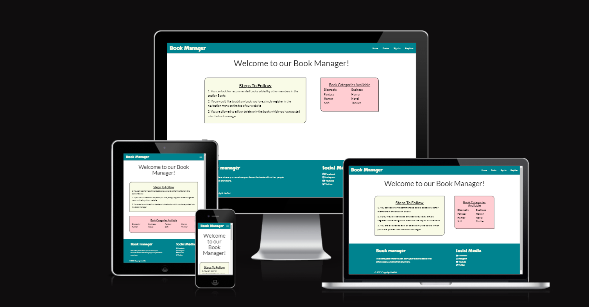

This project was created as a web app application using Python, Flask framework, MongoDB non-relational database system and Heroku Cloud platform. It was made for educational purposes only.

The business goals for this website are:

1. To boost the Book Manager brand awareness and interact with its users
2. To achieve higher reachability and get more leads
3. To build database of users
4. To increase sales from new and returning customers

The user goals of this website are:

1. As a first-time visitor, I want to be able to register on the page, sign-in and add a book to the book manager
2. As a recurring or first-time visitor, I want to be able to find the books in the book manager and search through them, find the information about them and possibly buy them
3. As a recurring visitor, I want to be able to access the book I uploaded on the website and be able to delete or edit it
4. As an administrator, I should be able to manage categories of the books
5. As an administrator, I should be able to have access to the database

## UX

### **Strategy**

Considering the core UX principles, as first I started to think about the strategy for this website and defined who the target users would be and what features/technologies they would want.

Book Manager target users are:

* Aged 01-99
* Book lovers, anyone who loves to read and want to share it
* Would like to meet new people
* Would like to get inspired by others recommendations

What these users would be looking for:

* Clear information on how to follow through the website and easy-to-use navigation
* Good & simple-looking design which makes the website look desirable
* Possibility to register and share their ideas
* Possibility to search through books by author, book or category name
* Access to social media links to follow the news

This project has been built to offer all of these things. An effort was taken to provide as intuitive interaction as possible for every user visiting the webpage.

### **Scope**

To achieve the desired user and business goals, the following features will be included in this release:

* Simple 'Home' section with logo, navigation panel and information below, including footer with social media links as well
* 'Books' page where the user can search through the book manager by author, book or category name, and see already posted books by other members
* Every book contains information such as author name, book name, image, category, a brief book summary and which user posted it
* Every book includes button 'Buy Here' which will lead the user to Amazon marketplace where the book can be bought
* If the user has already registered, signed in and posted a book to the book manager, he can edit or delete it by clicking on the buttons located on the card of the book
* If the user has not yet been registered, he can do so in the 'Register' page
* The user can sign in to the book manager in the 'Sign In' page
* The user can sign out from the book manager clicking on the 'Sign Out' button in the navigation menu

### **Structure**

The app's Back End has been built using Python, especially routing and template method with Flask framework to be more flexible and less time wasting. All data are saved on MongoDB and fully accessible through the provided dashboard. Connection to database has been coded through Python. Passwords are put through hashing algorithm for basic security hygiene. Routing has also been used to create 404 and 500 response pages.

The website is made up of multiple pages which change accordingly to interaction of the user. After the first opening appears 'Home' page with navigation menu for: 'Home', 'Books', 'Sign In' and 'Register' pages. After logging in, a visitor can see 'Add Book' or 'Sign Out' as well. The navigation is always visible and accessible.

It's important to mention that I used Materialize for its design principles and grid system to make sure that responsiveness is on point.

A special user called 'admin' can access the categories and manage them after logging in. Only he can add, edit or delete any category. All the currently available categories are shown on the 'Home' page.

All important actions gives feedback to the user in form of Flash messages built on Python, for example after registration, adding a book or signin in.

### **Skeleton**

As this project is mostly about Back End and database connection with CRUD system, I decided to focus more on that part and kept design as simple as possible.

I intentionally used CSS styling to make interaction with this web apllication handy, for example with text styling, shadow and hovering effect on buttons, card designs or forms.

Last but not least, I worked on responsiveness to allow users using the book manager on different devices without any additional errors.

I felt that all mentioned above helps to provide the best User Experience and highlight the purpose of this project.

### Color Scheme

I chose a color palette based around white & black as these colors are elegant and simple to implement into the design. I added teal and beige color for buttons and headings. Additionally, I chose to use other colors for hover effects and box shadowing, but the main palette has been around these colors:

* `#000000` used for primary text or background
* `#ffffff` used for secondary text
* `#f9fbe7` used for primary highlights
* `#00838f` used for secondary highlights
* `#29b6f6` and `#e57373` used for buttons

I used [coolors.co](https://coolors.co/ffffff-000000-f9fbe7-00838f-29b6f6-e57373) to help me generate my color palette.

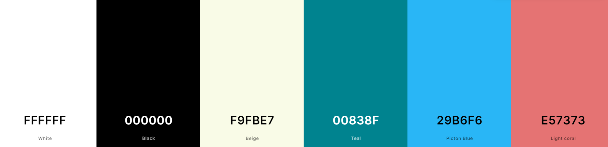

The colors has been mainly used with the help of Materialize.

### Typography

I decided to use Google font 'Lato' with different font weights throughout the project thanks to its elegance. I left the font 'sans-serif' as a backup font style if anything goes wrong with the Google link. Secondly, I used Google font 'Skranji' for logo of the website and footer.

* [Lato](https://fonts.google.com/specimen/Lato)

* [Sans-serif](https://fonts.google.com/knowledge/glossary/sans_serif)

* [Skranji](https://fonts.google.com/specimen/Skranji)

## Features

All of the next pages looks similar thanks to the Python template method.

Due to the wide age group of the users, it is assumed that most users will be viewing the site not only on their mobile phones but also on their tablets or computers. Therefore, creating something responsive is integral to the design.

### Existing Features

* **Home Page**

'Home Page' contains the navigation menu on the top with the logo, the information for the user to follow, and the footer which contains the social media links. Information for the user shows the steps to follow and the book categories which are currently available in the book manager - this part is connected to the database and can be updated by administrator. That means that any changes in categories can be seen here.

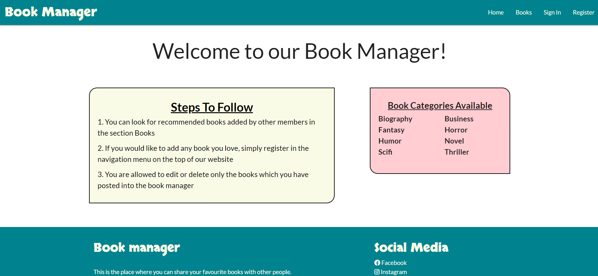

* **Books Page**

This page is the most important one of the whole project. It shows in order all the uploaded books to the database. The user can see image of the book, name of the book, category, author, short book summary and which user added it. There is an additional button provided which will lead the user to the Amazon Marketplace (with faketag).

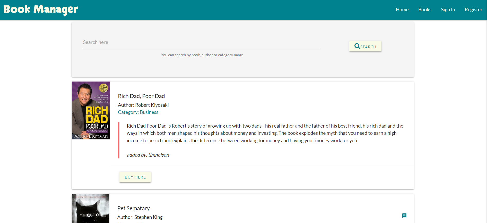

* **Search Bar on Books Page**
  
Almost on the top of the 'Books Page' is placed search bar which is meant to help people to search through by book, author or category name. In the example below, I tried to find the category name 'Novel' and it actually found me only these books that have this category name. This feature is helpful for anyone and useful when many books are added into the book manager.

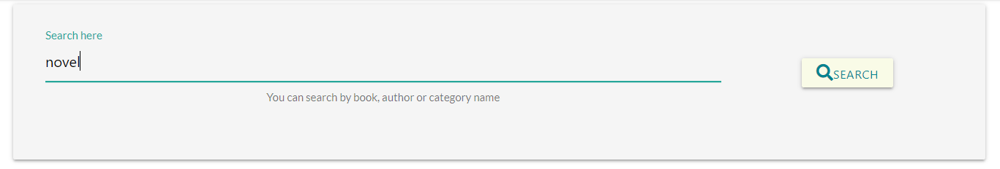
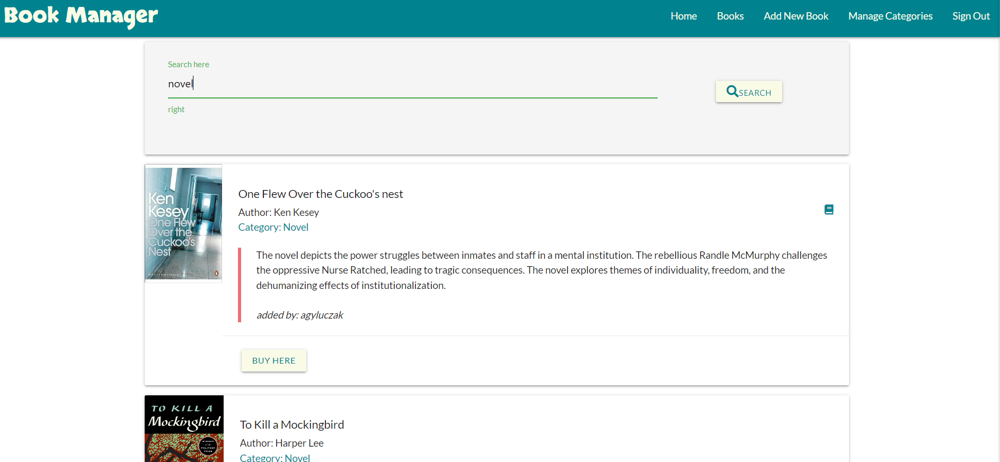

* **Register Page**

On this page, user can simply register to our book manager by typing their username and password. All of the information will be shared to our database. As part of the deffensive programming, I chose to limit the required characters to 5-15 and added password to database is hashed using Python (Werkzeug) to add security.

* **Sign In Page**

When user is already registered, he can sign in to our book manager using this page.

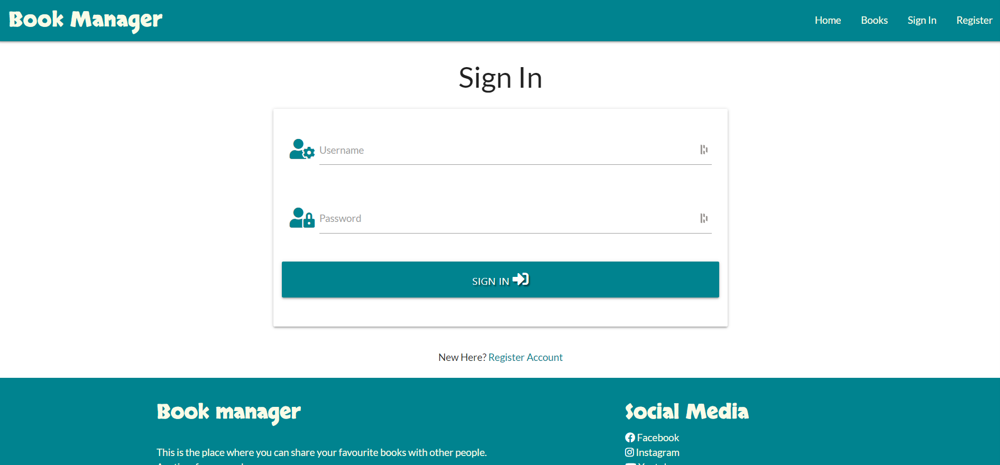

* **Add Book Page**

By clicking the 'Add New Book' button on the navigation panel, user will be redirected to this page where he can add the book to our book manager. It is a form which user can fill and then by adding the book to the database, book will be shown as the last one on the 'Books Page'. As part of the deffensive programming, the input fields are required and has to be filled in. The current signed in user will be shown as the user who added the book to the database.

As shown on the second screenshot below, the user is now able to see the buttons for editing or deleting the book itself.

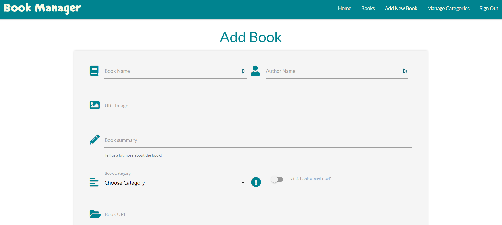
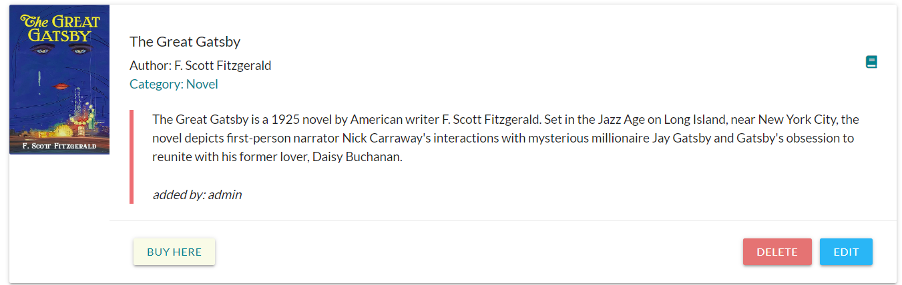

* **Edit Book Page**

When the user want to edit the book, he will be redirected to this page where is the form with already filled information of the actual book. By editing the book, the information will be changed in the database and then shown on the page. If the user would like to discard all of the changes, there is a button 'Cancel' which won't submit any changes made.

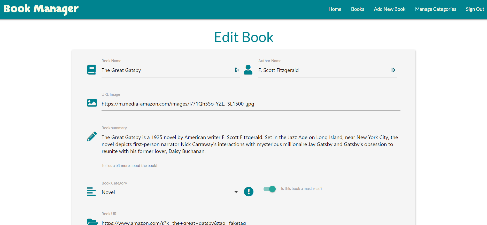

* **Sign Out Page**

The user can use the navigation panel when he would like to sign out from the page.

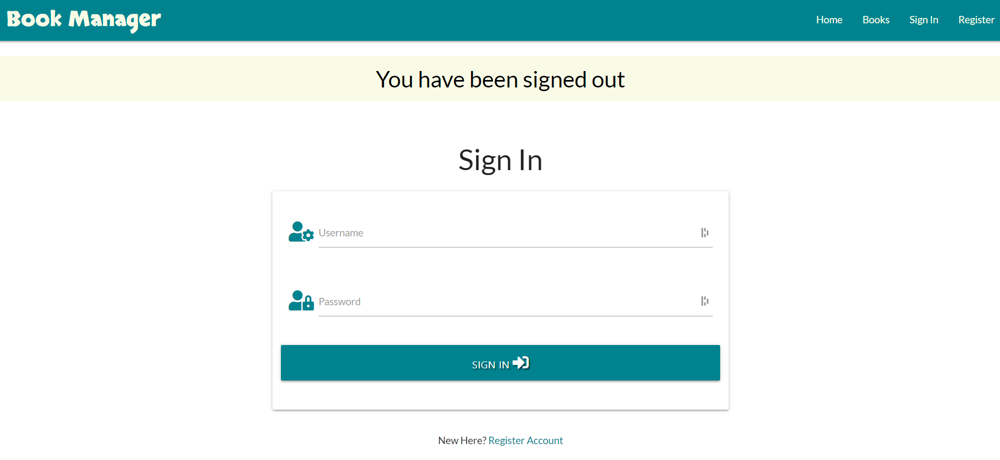

* **Manage Categories Page**

This is a part of the website which is accessible only for administrator. As mentioned above, I had to make sure that administrator could manipulate with categories and this is the page that is connected to database. The administrator can see the current categories, edit them, delete them or add a new one. Any changes are visible on the 'Home Page'.

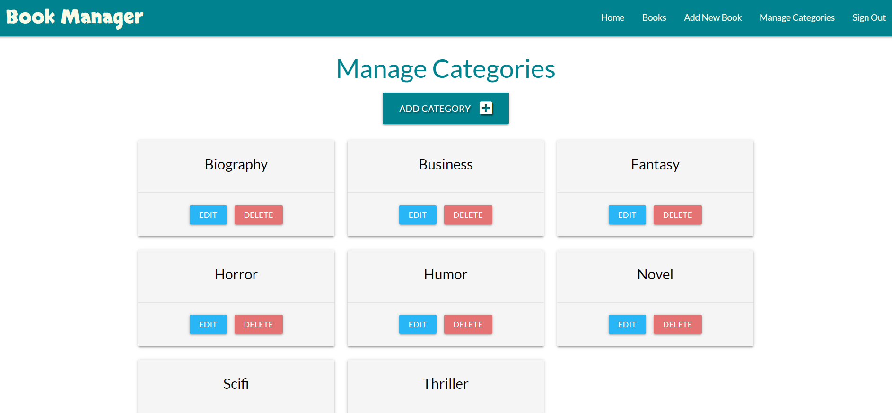

* **Add Category Page**

On this page, the administrator can add new category to the database.

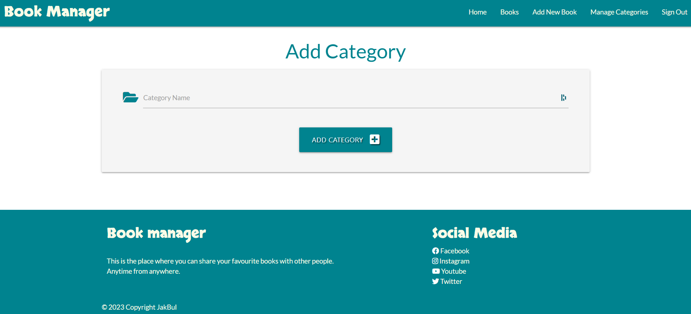

* **Edit Category Page**

On this page, the administrator can edit the current category, which will be updated in the database after submit. If the administrator would like to discard all of the changes, there is a button 'Cancel' which won't submit any changes.

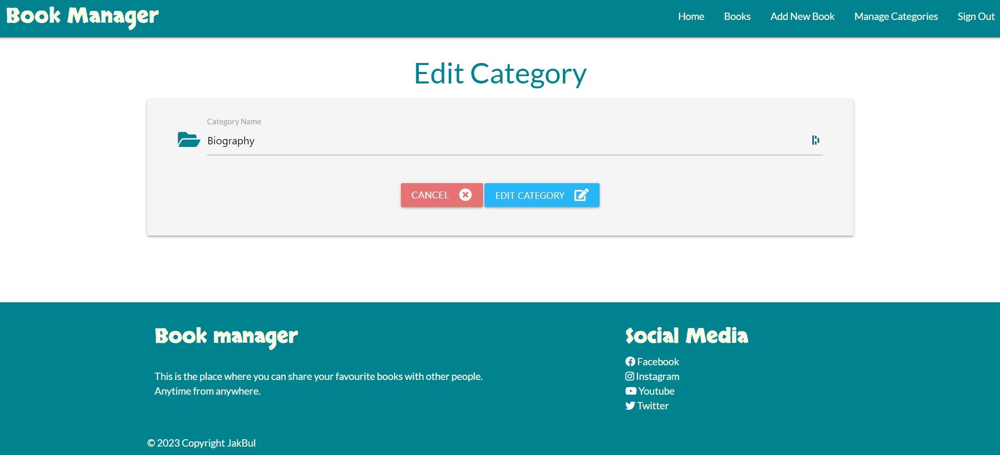

* **404 Error Message**

When anything goes wrong with the links of the website, the 404 page pops up to make sure it leads the user to the 'Home Page' by clicking on the button. Alternatively, user can use the navigation panel to visit another part of the website.

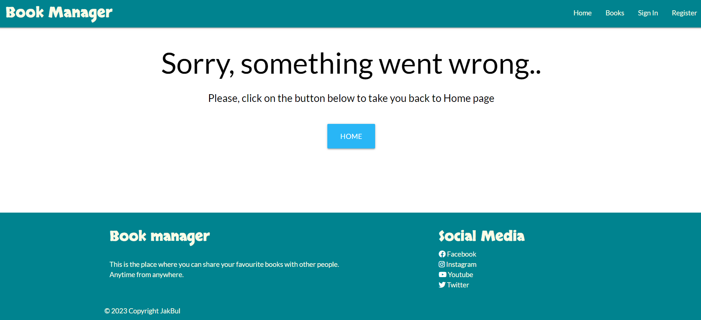

* **Flash Message**

The flash messages are generated with Python and provide additional feedback to users interaction, for example after adding a book to the book manager or registration. They are always under the navigation panel to make sure they are visible.

* **Responsive Navigation Panel**

As part of the responsive design, I had to be sure that the navigation is always visible and accessible to the user. That's why I used the dynamic navbar from Materialize for this project. It follow our UX principles and add a nice touch when the user uses a smaller device.

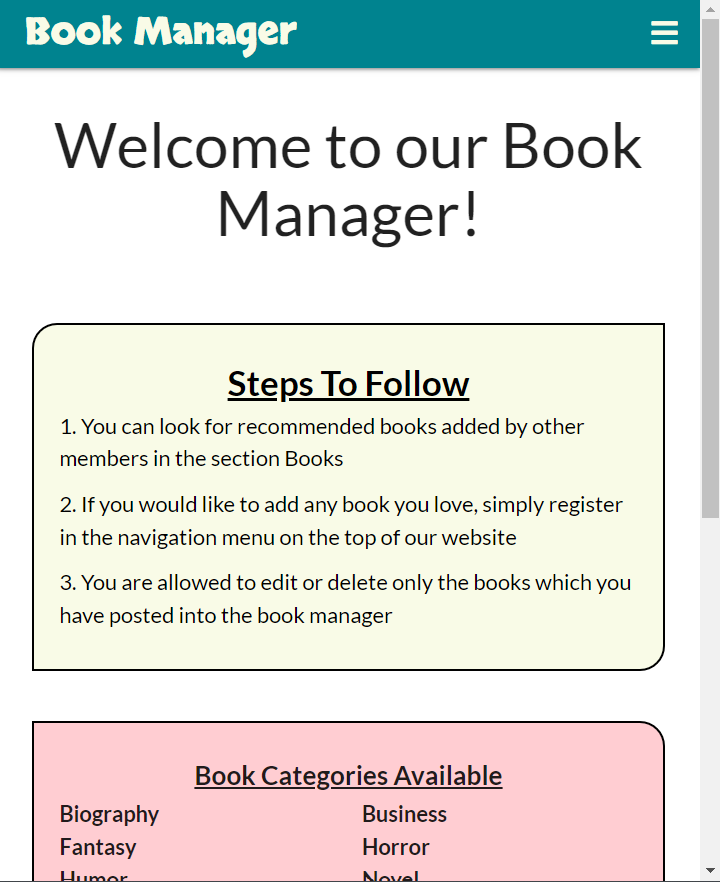
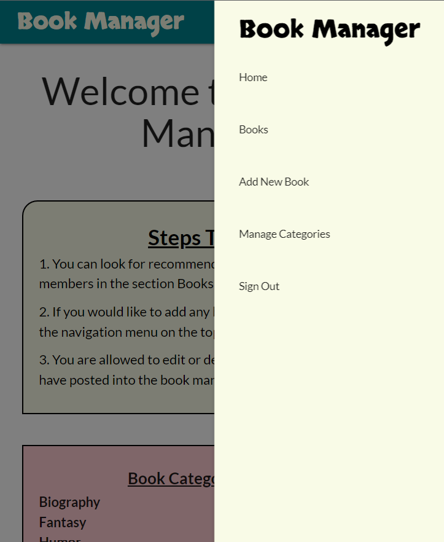

* **Favicon**

As a rule of thumb, I added the Favicon which relates to the topic of the project.

### Future Features

* **Uploaded Images for Books**

It would be better to have uploaded images of the book covers to the database than using the URL of image. However, how would I check the copy rights? Is it not easier for users just paste the link?

* **Recommended Books**

I think it could be helpful to have a special place for the best upvoted books so users could easily find the popular one, especially when already many books would be posted in the book manager which means it would be harder to search through them.

* **Users Profile**
This feature would be the best one I suppose. Every user would have a good presentable profile with all the books he has ever added and could share it with anyone via the link provided. It could help with reachability and definitely would bring more users.

## Tools & Technologies Used

* [HTML](https://en.wikipedia.org/wiki/HTML) used for the main site content
* [CSS](https://en.wikipedia.org/wiki/CSS) used for the main site design and layout
* [JavaScript](https://en.wikipedia.org/wiki/JavaScript) used for user interaction on the site
* [Python](https://en.wikipedia.org/wiki/Python_(programming_language)) used as a back end site
* [Flask](https://flask.palletsprojects.com/en/2.3.x/) used for developing the web application
* [Git](https://git-scm.com) used for version control (`git add`, `git commit`, `git push`)
* [GitHub](https://github.com) used for secure online code storage
* [Heroku](https://heroku.com) used for hosting the deployed front-end site
* [CodeAnywhere](https://codeanywhere.com) used as a cloud-based IDE for the development
* [MongoDB](https://mongodb.com) used for database system
* [Materialize](https://materializecss.com/) used as the front-end CSS framework for modern responsiveness and pre-built components
* [Font Awesome](https://fontawesome.com/) used to obtain the media icons
* [Google Fonts](https://fonts.google.com/) used to obtain the fonts linked in the header and used in the project
* [Google Developer Tools](https://developers.google.com/web/tools/chrome-devtools) used as a primary method of fixing spacing issues, finding bugs, and testing responsiveness across the project
* [Grammarly](https://www.grammarly.com/) used to fix the thousands of grammar errors across the project
* [Coloors](https://coolors.co/) used to create a color palette for the design
* [W3C Markup Validation Service](https://validator.w3.org/) used to validate all HTML code written and used on this webpage
* [W3C CSS Validation Service](https://jigsaw.w3.org/css-validator/#validate_by_input) used to validate all CSS code written and used on this webpage
* [JSHint](https://jshint.com/) used to validate all JS code written and used on this webpage
* [AmIResponsive](http://ami.responsivedesign.is/) used to generate responsive images used in README file

## Media

I have not used any uploaded media images or videos for this project. All the book images are covers obtained as the url address from Amazon Marketplace.

# Testing

I used Google Dev Tools for testing the website and its layout. This allowed me to check the responsiveness of the site and quickly debug any issues that I came across.

## Code Validation

### HTML

I have used the recommended [HTML W3C Validator](https://validator.w3.org) to validate my HTML file.

| Page | W3C URL | Screenshot | Notes |
| --- | --- | --- | --- |
| Main Page | [W3C]() |  |  |

### CSS

I have used the recommended [CSS Jigsaw Validator](https://jigsaw.w3.org/css-validator) to validate my CSS file.

| File | Jigsaw URL | Screenshot | Notes |
| --- | --- | --- | --- |
| style.css | [Jigsaw](https://jigsaw.w3.org/css-validator/validator?uri=https%3A%2F%2Fflask-book-manager-f03e235c4fb6.herokuapp.com%2Fhome&profile=css3svg&usermedium=all&warning=1&vextwarning=&lang=en) | 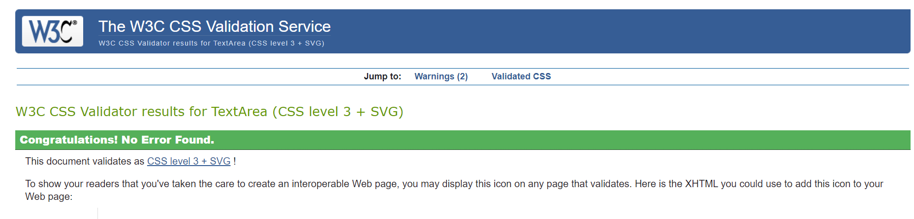 | Pass: No Errors when validated by input - getting 2 warning for import fonts. Note! Upon clicking on the link there will be shown many errors from Materialize |

### JavaScript

I have used the recommended [JSHint](https://jshint.com/) to validate my JS file.

| File | Screenshot | Notes |
| --- | --- | --- |
| script.js | 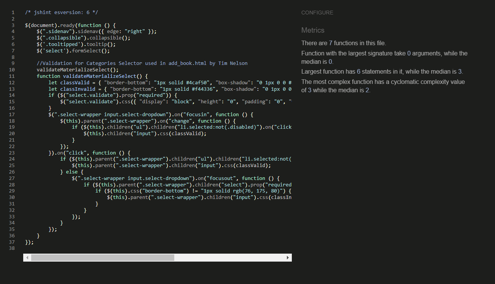 | Pass: No Errors when validated by input with ES6 standard (enabled jQuery) |

## Browser Compatibility

I have tested my deployed project on multiple browsers to check for compatibility issues.

| Browser | Screenshot | Notes |
| --- | --- | --- |
| Chrome |  | Works as expected |
| Edge | 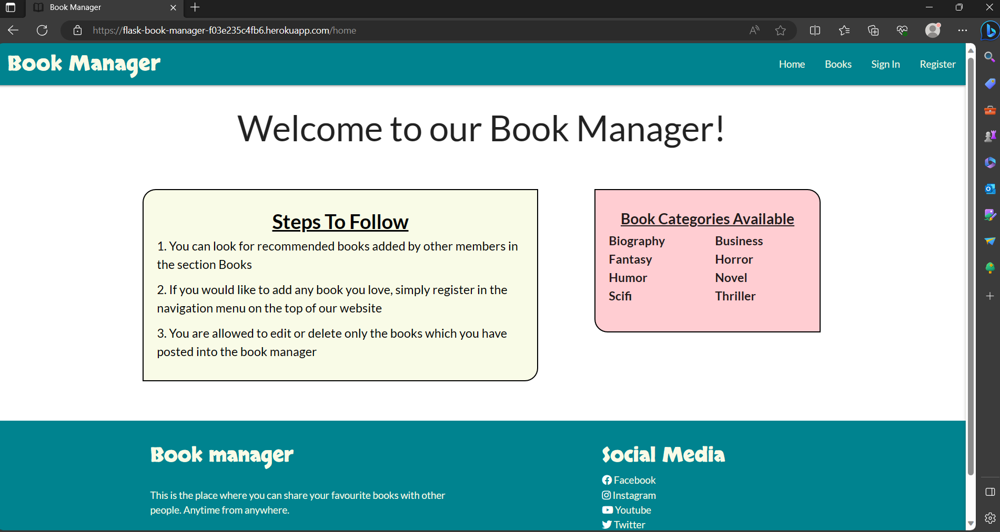 | Works as expected |
| Safari (phone) | 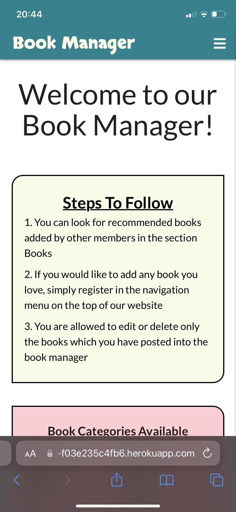 | Works as expected |

## Responsiveness

I have tested my deployed project on multiple devices to check for responsivity issues.

| Device | Screenshot | Notes |
| --- | --- | --- |
| Mobile iPhone 13 |  | Works as expected |
| Mobile iPhone 10 |  | Works as expected |
| Tablet (DevTools) |  | Works as expected |
| Desktop |  | Works as expected |

## Lighthouse Audit

I have tested my deployed project using the Lighthouse Audit tool to check for any major issues.

| Page | Size | Screenshot | Notes |
| --- | --- | --- | --- |
| Home | Desktop |  | One irrelevant warning |
| Home | Mobile |  |  |

## User Story Testing

| User Story | Screenshot | Comments |
| --- | --- | --- |
| As a first-time visitor, I want to be able to register on the page, sign-in and add a book to the book manager |  | All of these steps are described in the part Features, it's exactly the built flow of the website |
| As a recurring or first-time visitor, I want to be able to find the books in the book manager and search through them, find the information about them and possibly buy them |  | Possible on the 'Books Page' to look for the books and use the Search bar for searching through them |
| As a recurring visitor, I want to be able to access the book I uploaded on the website and be able to delete or edit it |  | Every book added to the database is managable by the user who added it thanks to the buttons |
| As an administrator, I should be able to manage categories of the books |  | 'Manage Categories Page' is exactly built for that User Story |
| As an administrator, I should be able to have access to the database | 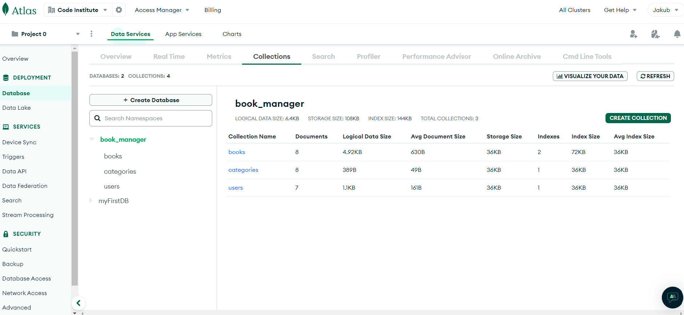 | Me as the administrator can access the MongoDB database and manipulate with the data |

## Known bugs and fixes

Here is an example of a bug in the code. While testing my CSS through CSS Validation, I got an error for the margin-top using too many values. I didn't find it myself and I was thinking why it doesn't work properly on the deployed website. Thanks to the CSS Validation I found the mistake and could easily fix it by using just one value of 40px which I actually need.

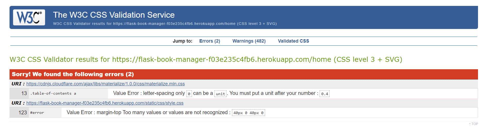
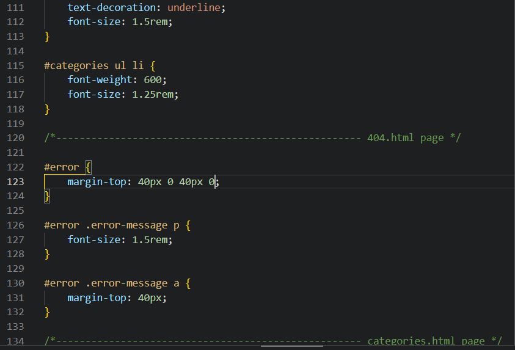

## Unfixed Bugs

There are no other remaining bugs that I am aware of.

# Deployment
