# BOOK MANAGER

[Visit the website here](https://flask-book-manager-f03e235c4fb6.herokuapp.com)

This project was created as a web app application using Python, Flask framework, MongoDB non-relational database system and Heroku Cloud platform. It was made for educational purposes only.

The business goals for this website are:

1. To boost the Book Manager's brand awareness and interact with its users
2. To achieve higher reachability and get more leads
3. To build a database of users
4. To increase sales from new and returning customers

The user goals of this website are:

1. As a first-time visitor, I want to be able to register on the page, sign in and add a book to the book manager
2. As a recurring or first-time visitor, I want to be able to find the books in the book manager and search through them, find the information about them and possibly buy them
3. As a recurring visitor, I want to be able to access the book I uploaded on the website and be able to delete or edit it
4. As an administrator, I should be able to manage categories of the books
5. As an administrator, I should be able to have access to the database

## UX

### **Strategy**

Considering the core UX principles, first I started to think about the strategy for this website and defined who the target users would be and what features/technologies they would want.

Book Manager target users are:

* Aged 01-99
* Book lovers, anyone who loves to read and want to share it
* Would like to meet new people
* Would like to get inspired by others' recommendations

What these users would be looking for:

* Clear information on how to follow through the website and easy-to-use navigation
* Good & simple-looking design which makes the website look desirable
* Possibility to register and share their ideas
* Possibility to search through books by author, book or category name
* Access to social media links to follow the news

This project has been built to offer all of these things. An effort was taken to provide as intuitive interaction as possible for every user visiting the webpage.

### **Scope**

To achieve the desired user and business goals, the following features will be included in this release:

* Simple 'Home' section with logo, navigation panel and information below, including footer with social media links as well
* 'Books' page where the user can search through the book manager by author, book or category name, and see already posted books by other members
* Every book contains information such as author name, book name, image, category, a brief book summary and which user posted it
* Every book includes the button 'Buy Here' which will lead the user to the Amazon marketplace where the book can be bought
* If the user has already registered, signed in and posted a book to the book manager, he can edit or delete it by clicking on the buttons located on the card of the book
* If the user has not yet been registered, he can do so on the 'Register' page
* The user can sign in to the book manager on the 'Sign In' page
* The user can sign out from the book manager by clicking on the 'Sign Out' button in the navigation menu

### **Structure**

The app's Back End has been built using Python, especially the routing and template method with Flask framework to be more flexible and less time-wasting. All data are saved on MongoDB and fully accessible through the provided dashboard. Connection to the database has been coded through Python. Passwords are put through a hashing algorithm for basic security hygiene. Routing has also been used to create 404 and 500 response pages.

The website is made up of multiple pages which change according to the interaction of the user. After the first opening appears the 'Home' page with a navigation menu for the 'Home', 'Books', 'Sign In' and 'Register' pages. After logging in, a visitor can see 'Add Book' or 'Sign Out' as well. The navigation is always visible and accessible.

It's important to mention that I used Materialize for its design principles and grid system to make sure that responsiveness is on point.

A special user called 'admin' can access the categories and manage them after logging in. Only he can add, edit or delete any category. All the currently available categories are shown on the 'Home' page.

All important actions give feedback to the user in the form of Flash messages built on Python, for example after registration, adding a book or signing in.

### **Skeleton**

As this project is mostly about the Back End and database connection with the CRUD system, I decided to focus more on that part and kept the design as simple as possible.

I intentionally used CSS styling to make interaction with this web application handy, for example with text styling, shadow and hovering effects on buttons, card designs or forms.

Last but not least, I worked on responsiveness to allow users to use the book manager on different devices without any additional errors.

I felt that all mentioned above helps to provide the best User Experience and highlight the purpose of this project.

### Color Scheme

I chose a color palette based around white & black as these colors are elegant and simple to implement into the design. I added teal and beige colors for buttons and headings. Additionally, I chose to use other colors for hover effects and box shadowing, but the main palette has been around these colors:

* `#000000` used for primary text or background
* `#ffffff` used for secondary text
* `#f9fbe7` used for primary highlights
* `#00838f` used for secondary highlights
* `#29b6f6` and `#e57373` used for buttons

I used [coolors.co](https://coolors.co/ffffff-000000-f9fbe7-00838f-29b6f6-e57373) to help me generate my color palette.

The colors have been mainly used with the help of Materialize.

### Typography

I decided to use Google font 'Lato' with different font weights throughout the project thanks to its elegance. I left the font 'sans-serif' as a backup font style if anything goes wrong with the Google link. Secondly, I used the Google font 'Skranji' for the logo of the website and footer.

* [Lato](https://fonts.google.com/specimen/Lato)

* [Sans-serif](https://fonts.google.com/knowledge/glossary/sans_serif)

* [Skranji](https://fonts.google.com/specimen/Skranji)

## Wireframes

To follow the best practices, wireframes were developed for mobile, tablet, and desktop sizes.
I've used [Balsamiq](https://balsamiq.com/wireframes) to design my two main site wireframes.

### Home Page Wireframes

| Size | Screenshot |
| --- | --- |
| Mobile | 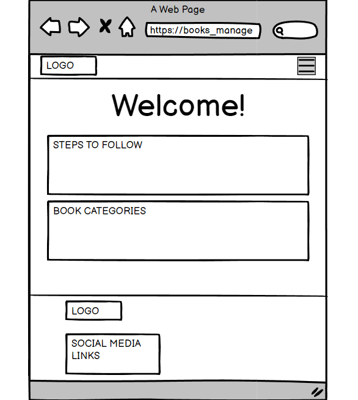 |
| Tablet | 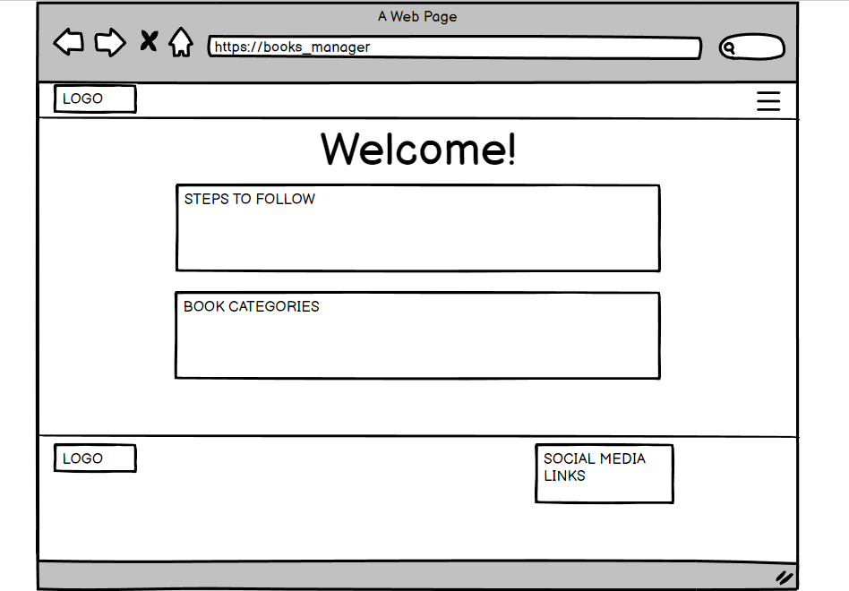 |
| Desktop | 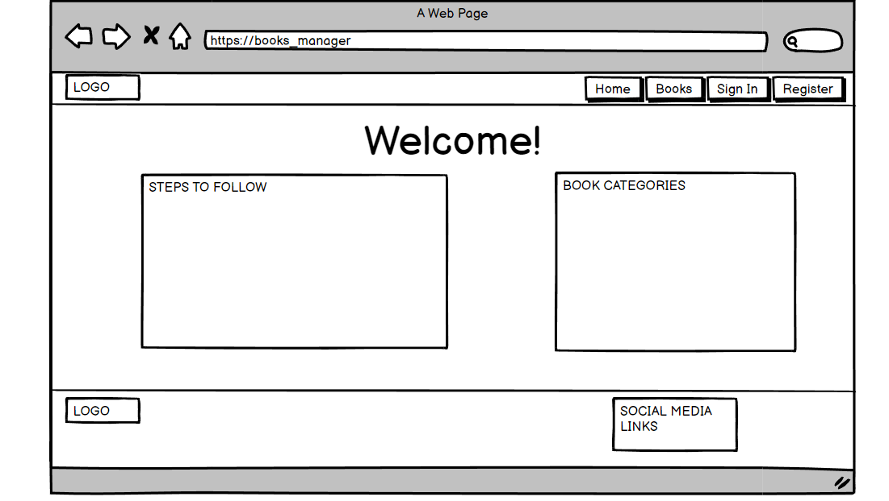 |

### Books Page Wireframes

| Size | Screenshot |
| --- | --- |
| Mobile | 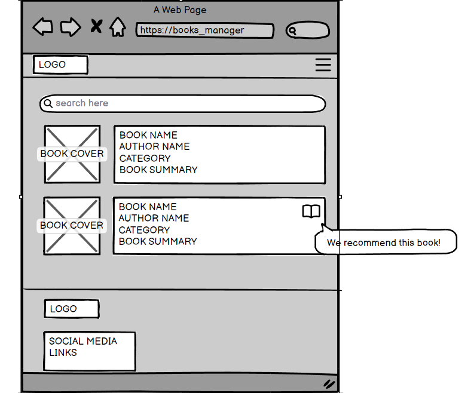 |
| Tablet | 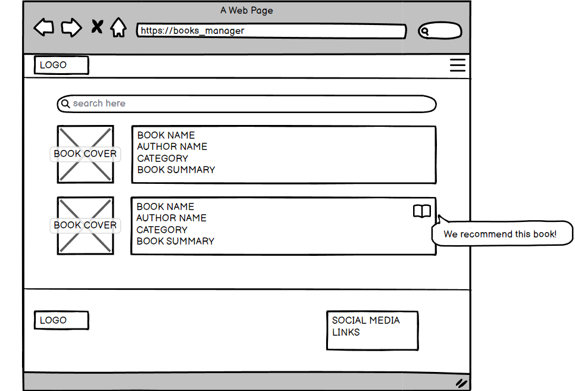 |
| Desktop | 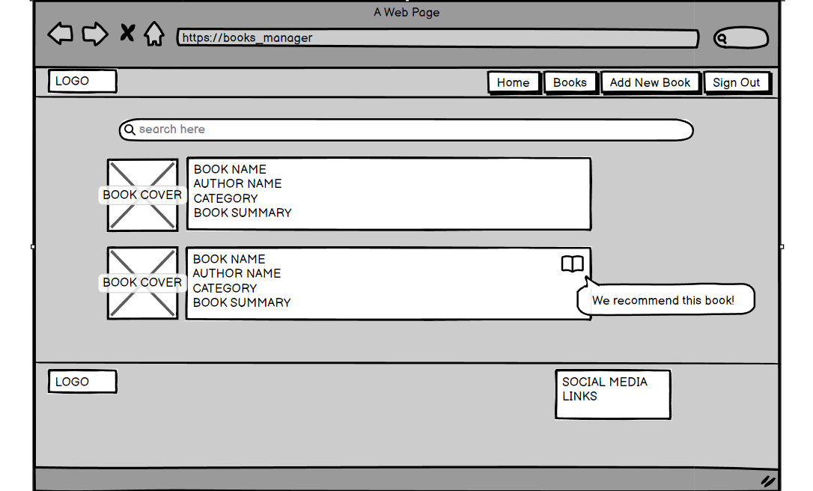 |

## Features

All of the next pages look similar thanks to the Python template method.

Due to the wide age group of the users, it is assumed that most users will be viewing the site not only on their mobile phones but also on their tablets or computers. Therefore, creating something responsive is integral to the design.

### Existing Features

* **Home Page**

'Home Page' contains the navigation menu on the top with the logo, the information for the user to follow, and the footer which contains the social media links. Information for the user shows the steps to follow and the book categories that are currently available in the book manager - this part is connected to the database and can be updated by an administrator. That means that any changes in categories can be seen here.

* **Books Page**

This page is the most important one of the whole project. It shows in order all the uploaded books to the database. The user can see an image of the book, the name of the book, the category, the author, the short book summary and which user added it. There is an additional button provided which will lead the user to the Amazon Marketplace (with fake tag).

* **Search Bar on Books Page**
  
Almost on the top of the 'Books Page' is placed a search bar which is meant to help people to search by book, author or category name. In the example below, I tried to find the category name 'Novel' and it found me only these books that have this category name. This feature is helpful for anyone and useful when many books are added to the book manager.

* **Register Page**

On this page, users can simply register to the book manager by typing their username and password. All of the information will be shared with the database.

As part of the defensive programming, I chose to limit the required characters to 5-15 and the added password to the database use Python to add security(hashed password using Werkzeug).

* **Sign In Page**

When the user is already registered, he can sign in to the book manager using this page.

* **Add Book Page**

By clicking the 'Add New Book' button on the navigation panel, the user will be redirected to this page where he can add the book to the book manager. It is a form that user can fill and then by adding the book to the database, the book will be shown as the last one on the 'Books Page'.

As part of the defensive programming, the input fields are required and have to be filled in. The current signed-in user will be shown as the user who added the book to the database. Additionally, this page can be opened only when a user is logged in, otherwise the user gets an error.

As shown in the second screenshot below, the user is now able to see the buttons for editing or deleting the book itself.

* **Edit Book Page**

When the user wants to edit the book, he will be redirected to this page where is the form with already filled information about the actual book. By editing the book, the information will be changed in the database and then shown on the page. If the user would like to discard all of the changes, there is a button 'Cancel' which won't submit any changes made.

As part of the defensive programming, this page can be opened only when the user who created the book is logged in, otherwise the user gets an error. The same counts for deleting the book.

* **Sign Out Page**

The user can use the navigation panel when he would like to sign out from the page.

* **Manage Categories Page**

This is a part of the website which is accessible only to administrators. As mentioned above, I had to make sure that the administrator could manipulate categories and this is the page that is connected to the database. The administrator can see the current categories, edit them, delete them or add a new one. Any changes are visible on the 'Home Page'.

As part of the defensive programming, this page can be opened only when the user is the administrator, otherwise the user gets an error.

* **Add Category Page**

On this page, the administrator can add a new category to the database.

As part of the defensive programming, this page can be opened only when the user is the administrator, otherwise the user gets an error.

* **Edit Category Page**

On this page, the administrator can edit the current category, which will be updated in the database after submission. If the administrator would like to discard all of the changes, there is a button 'Cancel' which won't submit any changes.

As part of the defensive programming, this page can be opened only when the user is the administrator, otherwise the user gets an error. The same counts for deleting the category.

* **404 Error Message**

When anything goes wrong with the links of the website, the 404 page pops up to make sure it leads users to the 'Home Page' by clicking on the button. Alternatively, users can use the navigation panel to visit another part of the website.

* **Flash Message**

The flash messages are generated with Python and provide additional feedback to the user interaction, for example after adding a book to the book manager or registration. They are always under the navigation panel to make sure they are visible.

* **Responsive Navigation Panel**

As part of the responsive design, I had to be sure that the navigation is always visible and accessible to the user. That's why I used the dynamic navbar from Materialize for this project. It follows the chosen UX principles and adds a nice touch when the user uses a smaller device.

* **Favicon**

As a rule of thumb, I added the Favicon which relates to the topic of the project.

### Future Features

* **Uploaded Images for Books**

It would be better to have uploaded images of the book covers to the database than using the URL of the image. However, how would I check the copyrights? Is it not easier for users just to paste the link?

* **Recommended Books**

I think it could be helpful to have a special place for the best-upvoted books so users could easily find the popular ones, especially when already many books are posted in the book manager which means it would be harder to search through them.

* **Users Profile**

This feature would be the best one I suppose. Every user would have a good presentable profile with all the books he has ever added and could share it with anyone via the link provided. It could help with reachability and definitely would bring more users.

## Tools & Technologies Used

* [HTML](https://en.wikipedia.org/wiki/HTML) used for the main site content
* [CSS](https://en.wikipedia.org/wiki/CSS) used for the main site design and layout
* [JavaScript](https://en.wikipedia.org/wiki/JavaScript) used for user interaction on the site
* [Python](https://www.python.org) used as the back-end programming language
* [Flask](https://flask.palletsprojects.com) used as the Python framework for the site
* [Git](https://git-scm.com) used for version control (`git add`, `git commit`, `git push`)
* [GitHub](https://github.com) used for secure online code storage
* [Heroku](https://heroku.com) used for hosting the deployed back-end site
* [CodeAnywhere](https://codeanywhere.com) used as a cloud-based IDE for the development
* [MongoDB](https://www.mongodb.com) used as the non-relational database management with Flask
* [Materialize](https://materializecss.com/) used as the front-end CSS framework for modern responsiveness and pre-built components
* [Font Awesome](https://fontawesome.com/) used to obtain the media icons
* [Google Fonts](https://fonts.google.com/) used to obtain the fonts linked in the header and used in the project
* [Google Developer Tools](https://developers.google.com/web/tools/chrome-devtools) used as a primary method of fixing spacing issues, finding bugs, and testing responsiveness across the project
* [Grammarly](https://www.grammarly.com/) used to fix the thousands of grammar errors across the project
* [Coloors](https://coolors.co/) used to create a color palette for the design
* [W3C Markup Validation Service](https://validator.w3.org/) used to validate all HTML code written and used on this webpage
* [W3C CSS Validation Service](https://jigsaw.w3.org/css-validator/#validate_by_input) used to validate all CSS code written and used on this webpage
* [JSHint](https://jshint.com/) used to validate all JS code written and used on this webpage
* [PEP8 CI Python Linter](https://pep8ci.herokuapp.com) used to validate all of my Python files
* [AmIResponsive](http://ami.responsivedesign.is/) used to generate responsive images used in README file
* [Balsamiq](https://balsamiq.com/wireframes) used to design my wireframes

## Media

I have not used any uploaded media images or videos for this project. All the book images are covers obtained as the URL address from Amazon Marketplace.

## Database Design

My project uses a non-relational database with MongoDB, and therefore the database architecture
doesn't have actual relationships like a relational database would.

My database is called **book_manager**.

It contains 3 collections:

* **categories**
    | Key | Type | Notes |
    | --- | --- | --- |
    | _id | ObjectId() | |
    | category_name | String | |

* **books**
    | Key | Type | Notes |
    | --- | --- | --- |
    | _id | ObjectId() | |
    | category_name | String | selected from *categories* collection |
    | book_name | String | |
    | author_name | String | |
    | image_url | String | |
    | book_summary | String | |
    | must_read | String | |
    | book_url | String | |
    | created_by | String | selected from the *users* collection |

* **users**
    | Key | Type | Notes |
    | --- | --- | --- |
    | _id | ObjectId() | |
    | username | String | |
    | password | String | uses Secure Hash Algorithm (SHA) |

# Testing

I used Google Dev Tools to test the website and its layout. This allowed me to check the responsiveness of the site and quickly debug any issues that I came across.

## Code Validation

### HTML

I have used the recommended [HTML W3C Validator](https://validator.w3.org) to validate my HTML file. However, I have had a problem with this task..

Python uses Jinja syntax, such as ``, ``, and `{{ variable|filter }}`, and they will not validate properly if I am copying/pasting into the HTML validator. To properly validate HTML pages with Jinja syntax, I have to use **View Page Source** on each website and validate by inputting the entire compiled code.

Even this approach gets some warnings, but most of them were caused by Materialize or Jinja template.

| Page | Screenshot | Notes |
| --- | --- | --- |
| Home Page | 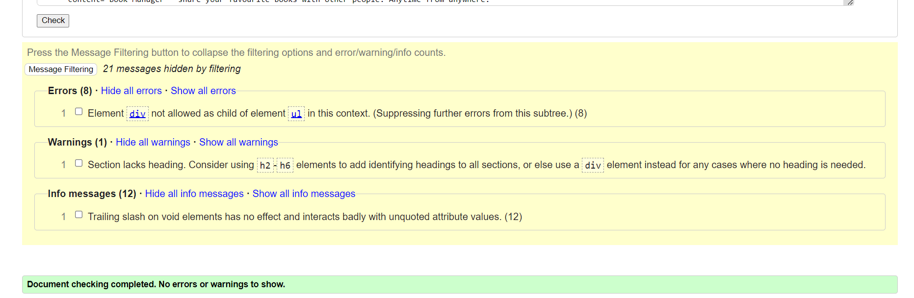 | |
| Books Page | 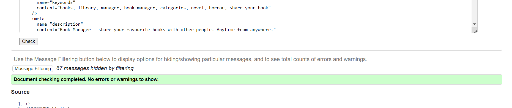 | |
| Sign In Page |  | |
| Register Page | 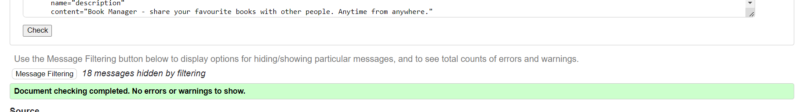 | |
| Add Book | 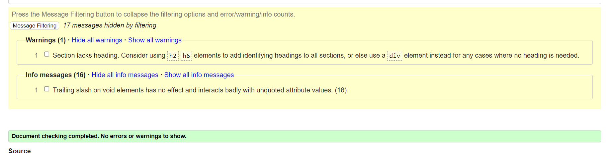 | |
| Edit Book | 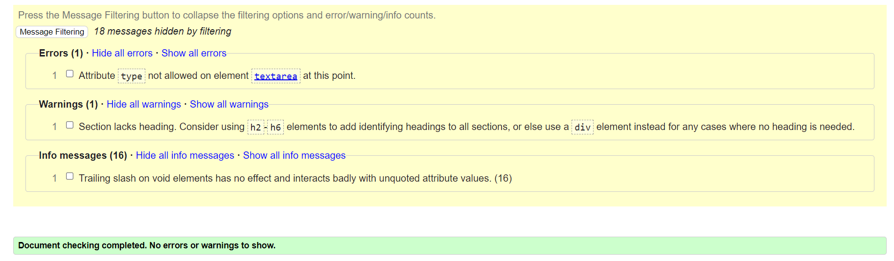 | 1 Error has already been fixed |
| 404 Error Page | 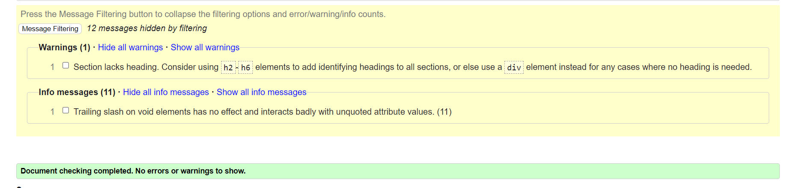 | |

### CSS

I have used the recommended [CSS Jigsaw Validator](https://jigsaw.w3.org/css-validator) to validate my CSS file.

| File | Jigsaw URL | Screenshot | Notes |
| --- | --- | --- | --- |
| style.css | [Jigsaw](https://jigsaw.w3.org/css-validator/validator?uri=https%3A%2F%2Fflask-book-manager-f03e235c4fb6.herokuapp.com%2Fhome&profile=css3svg&usermedium=all&warning=1&vextwarning=&lang=en) |  | Pass with no errors when validated by input - getting 2 warnings for import of fonts. Note! Upon clicking on the link there will be shown many errors from Materialize |

### JavaScript

I have used the recommended [JSHint](https://jshint.com/) to validate my JS file.

| File | Screenshot | Notes |
| --- | --- | --- |
| script.js |  | Pass with no errors when validated by input with ES6 standard (enabled jQuery)  |

### Python

I have used the recommended [PEP8 CI Python Linter](https://pep8ci.herokuapp.com) to validate all of my Python files.

| File | Screenshot | Notes |
| --- | --- | --- |
| app.py | 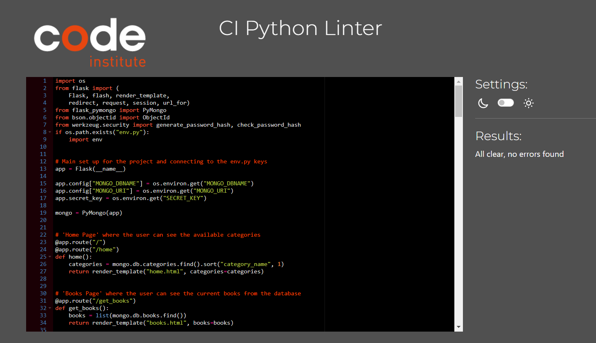 | Pass with no errors when validated by input |

## Browser Compatibility

I have tested my deployed project on multiple browsers to check for compatibility issues.

| Browser | Screenshot | Notes |
| --- | --- | --- |
| Chrome |  | Works as expected |
| Edge |  | Works as expected |
| Safari (phone) |  | Works as expected |

## Responsiveness

I have tested my deployed project on multiple devices to check for responsivity issues.

| Device | Screenshot | Notes |
| --- | --- | --- |
| Mobile iPhone 13 | 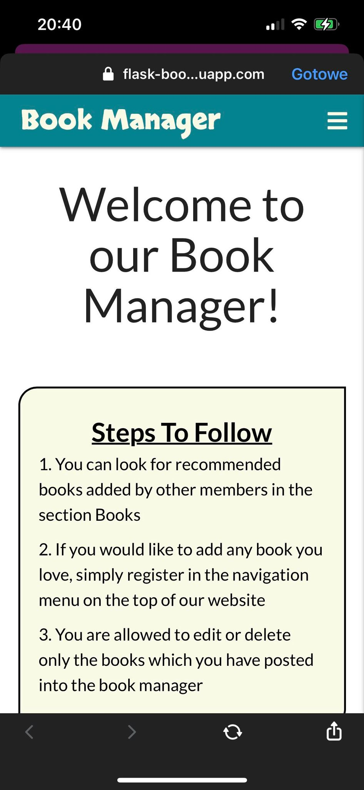 | Works as expected |
| Mobile iPhone 10 |  | Works as expected |
| Tablet (DevTools) | 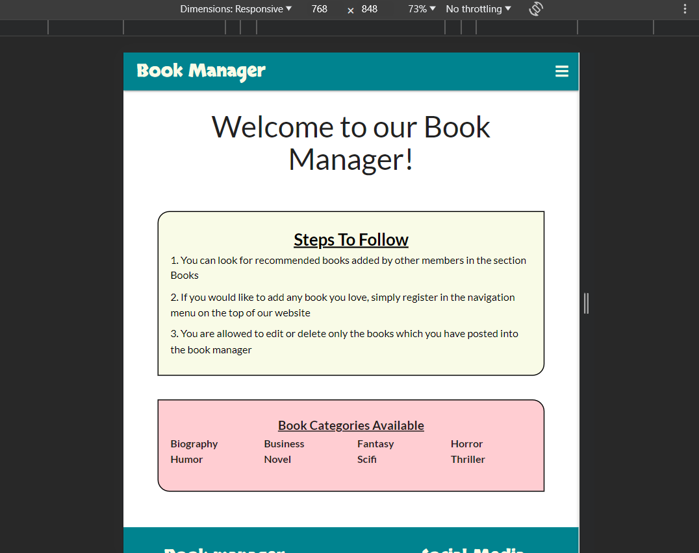 | Works as expected |
| Desktop |  | Works as expected |

## Lighthouse Audit

I have tested my deployed project using the Lighthouse Audit tool to check for any major issues.

| Page | Size | Screenshot | Notes |
| --- | --- | --- | --- |
| Home | Desktop |  | One irrelevant warning |
| Home | Mobile |  |  |

## User Story Testing

| User Story | Screenshot | Comments |
| --- | --- | --- |
| As a first-time visitor, I want to be able to register on the page, sign in and add a book to the book manager |  | All of these steps are described in the part Features, it's exactly the built flow of the website |
| As a recurring or first-time visitor, I want to be able to find the books in the book manager and search through them, find the information about them and possibly buy them |  | It is possible on the 'Books Page' to look for the books and use the Search bar to search through them |
| As a recurring visitor, I want to be able to access the book I uploaded on the website and be able to delete or edit it |  | Every book added to the database is manageable by the user who added it thanks to the buttons |
| As an administrator, I should be able to manage categories of the books |  | 'Manage Categories Page' is exactly built for that purpose |
| As an administrator, I should be able to have access to the database |  | I as the administrator can access the MongoDB database and manipulate the data |

## Known bugs and fixes

Here is an example of a bug in the code. While testing my CSS through CSS Validation, I got an error for the margin-top using too many values. I didn't find it myself and I was thinking why it doesn't work properly on the deployed website. Thanks to the CSS Validation I found the mistake and could easily fix it by using just one value of 40px which I need.

## Unfixed Bugs

There are no other remaining bugs that I am aware of.

# Deployment

The live deployed application can be found deployed on [Heroku](https://flask-book-manager-f03e235c4fb6.herokuapp.com).

### MongoDB Non-Relational Database

This project uses [MongoDB](https://www.mongodb.com) for the Non-Relational Database.

To obtain your own MongoDB Database URI, sign up on their site, then follow these steps:

* The name of the database on MongoDB should be called **insert-your-database-name-here**
* The collection(s) needed for this database should be **insert-your-collection-names-here**
* Click on the **Cluster** name created for the project
* Click on the **Connect** button
* Click **Connect Your Application**
* Copy the connection string, and replace `password` with your own password (also remove the angle brackets)

## Heroku Deployment

This project uses [Heroku](https://www.heroku.com), a platform as a service (PaaS) that enables developers to build, run, and operate applications entirely in the cloud.

Deployment steps are as follows, after account setup:

* Select **New** in the top-right corner of your Heroku Dashboard, and select **Create new app** from the dropdown menu
* Your app name must be unique, and then choose a region closest to you (EU or USA), and finally, select **Create App**
* From the new app **Settings**, click **Reveal Config Vars**, and set your environment variables

| Key | Value |
| --- | --- |
| `DATABASE_URL` | user's own value |
| `IP` | 0.0.0.0 |
| `MONGO_DBNAME` | user's own value |
| `MONGO_URI` | user's own value |
| `PORT` | 5000 |
| `SECRET_KEY` | user's own value |

Heroku needs two additional files to deploy properly:

* requirements.txt
* Procfile

You can install this project's **requirements** (where applicable) using:

* `pip3 install -r requirements.txt`

If you have your own packages that have been installed, then the requirements file needs updated using:

* `pip3 freeze --local > requirements.txt`

The **Procfile** can be created with the following command:

* `echo web: python app.py > Procfile`
* *replace **app.py** with the name of your primary Flask app name; the one at the root-level*

For Heroku deployment, follow these steps to connect your own GitHub repository to the newly created app:

Either:

* Select **Automatic Deployment** from the Heroku app

Or:

* In the Terminal/CLI, connect to Heroku using this command: `heroku login -i`
* Set the remote for Heroku: `heroku git:remote -a app_name` (replace *app_name* with your app name)
* After performing the standard Git `add`, `commit`, and `push` to GitHub, you can now type:
  * `git push heroku main`

The project should now be connected and deployed to Heroku!

### Local Deployment

This project can be cloned or forked to make a local copy on your own system.

For either method, you will need to install any applicable packages found within the *requirements.txt* file:

* `pip3 install -r requirements.txt`

#### Cloning

You can clone the repository by following these steps:

1. Go to the [GitHub repository](https://github.com/JakBul/Book_Manager)
2. Locate the Code button above the list of files and click it
3. Select if you prefer to clone using HTTPS, SSH, or GitHub CLI and click the copy button to copy the URL to your clipboard
4. Open Git shell or Terminal
5. Change the current working directory to the one where you want the cloned directory
6. In your IDE Terminal, type the following command to clone my repository:
	* `git clone https://github.com/JakBul/Book_Manager.git`
7. Press Enter to create your local clone

Alternatively, if using Gitpod, you can click below to create your own workspace using this repository.

Please note that to directly open the project in Gitpod, you need to have the browser extension installed.
A tutorial on how to do that can be found [here](https://www.gitpod.io/docs/configure/user-settings/browser-extension).

#### Forking

By forking the GitHub Repository, we make a copy of the original repository on our GitHub account to view and/or make changes without affecting the original owner's repository.
You can fork this repository by using the following steps:

1. Log in to GitHub and locate the [GitHub Repository](https://github.com/JakBul/Book_Manager)
2. At the top of the Repository (not the top of the page) just above the "Settings" Button on the menu, locate the "Fork" Button
3. Once clicked, you should now have a copy of the original repository in your own GitHub account!

## Credits

| Source | Location | Notes |
| --- | --- | --- |
| [Markdown Builder](https://traveltimn.github.io/markdown-builder) | README | Tool to help generate the Markdown files |

## Acknowledgments

* First and foremost, I would like to thank my Code Institute mentor Rohit for his support throughout the development of this project
* Secondly,  I would like to thank my Code Institute tutor, [Nigel Edwards](https://github.com/nigel-edwards) for his assistance and guidance from the very start of my studies
* In addition, I would like to thank the [Code Institute Slack community](https://code-institute-room.slack.com) for the moral support
